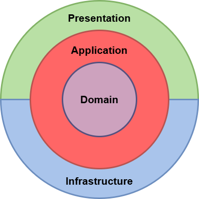
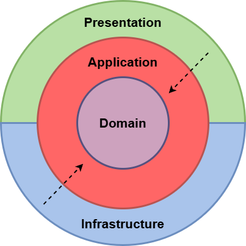
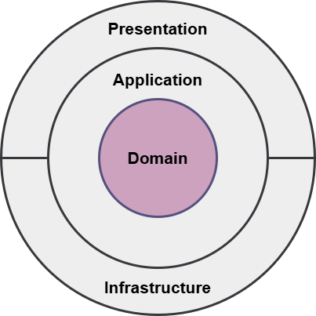
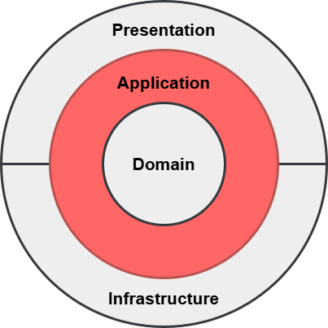
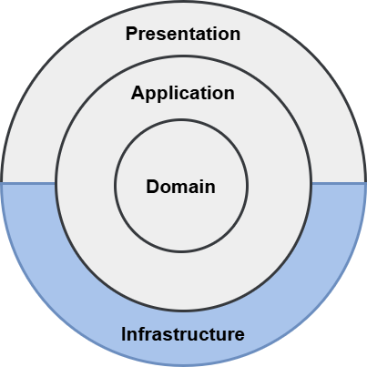
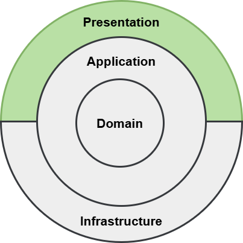

# 整洁架构

::: tip clean architecture

:::

## CleanArchitecture

## 架构设计原则

- 可测试性
- 松耦合
- 关注点分离
- 封装
- 依赖反转
- 单一责任
- DRY 不开发重复代码
- Persistence Ignorance
  强调领域模型或业务逻辑层不应该直接依赖于任何特定的数据持久化机制

## 依赖关系

- 依赖项向内传递
- 内部层定义接口
- 外部层负责实现

## 架构层次介绍

### Domain Layer

- Entities 实体
  - 定义: 实体是有唯一标识符的对象，其身份在生命周期中保持不变。实体不仅包含数据，还可能包含行为。
- Value objects 值对象
  - 定义: 值对象是没有唯一标识符的对象，其价值在于其属性的组合。值对象应该是不可变的。
  - 示例: 地址、货币金额、颜色等
- Domain events 领域事件
  - 定义: 领域事件是在领域模型中发生的、具有业务意义的事件。它们通常用于触发其他业务逻辑或进程。
  - 示例: 订单创建、支付完成、库存减少等。
- Domain services 领域服务
  - 定义: 领域服务是包含业务逻辑的无状态对象，这些逻辑不适合放在实体或值对象中。领域服务通常处理跨多个实体的操作。
  - 示例: 任务处理服务
- Interfaces 接口
  - 定义: 接口定义了对象或服务的行为规范，而不涉及具体的实现细节。接口确保了模块之间的松耦合。
  - 示例: IOrderService、IPaymentGateway、IInventoryManager等。
- Exceptions 异常
  - 异常定义
- Enums 枚举
  
### Application Layer

- Orchestrates the Domain (协调领域)
  - 定义：协调领域是指在系统中有一个组件或服务负责协调各个领域对象（如实体、值对象、领域服务等）之间的交互，确保业务逻辑的正确执行。
  - 作用：这个组件通常负责处理复杂的业务流程，调用多个领域服务和实体，确保业务规则的一致性和完整性。
  - 示例：一个订单处理服务可能会协调用户验证、库存检查、支付处理等多个步骤。
- Contains Business Logic (包含业务逻辑)
  - 定义：业务逻辑是指应用程序中与业务规则和操作相关的逻辑。它通常包括验证、计算、决策等操作。
  - 作用：业务逻辑是应用程序的核心部分，确保系统按照业务需求正确运行。
  - 示例：计算订单总价、验证用户权限、处理退款请求等。
- Defines the Use Cases (定义用例)
  - Application Services (应用服务)
    - 定义：应用服务是位于领域层和基础设施层之间的一层，负责协调领域对象和基础设施服务（如数据库、消息队列等）之间的交互。
    - 作用：应用服务通常实现用例，调用领域服务和基础设施服务，处理事务管理，确保业务逻辑的正确执行。
    - 示例：OrderApplicationService、UserApplicationService等。
  - CQRS with MediatR (命令查询职责分离与MediatR)CQRS (Command Query Responsibility Segregation)
    - 定义：CQRS是一种架构模式，将读取操作（查询）和写入操作（命令）分开，使用不同的模型来处理这两类操作。
    - 作用：通过分离读写操作，可以优化性能、提高可扩展性和简化复杂性。
    - 示例：读取模型可以是一个高度优化的只读数据库，写入模型可以是一个事务性强的数据库。

### Infrastructure Layer

- External Systems (外部系统)
  - 定义：第三方系统Api。
- Databases (数据库)
  - Orm
- Messaging (消息队列)

- Storage Services (存储服务)。
  - 作用：存储服务用于存储静态文件、备份数据、日志文件等。

- Identity (身份认证)
  - OAuth2、、JWT（JSON Web Tokens）等。
- System Clock (系统时钟)
  - 系统时钟是指操作系统或硬件提供的当前时间。在分布式系统中，系统时钟的同步非常重要，以确保时间戳的一致性。

### Presentation Layer

- 定义系统的入口点

- REST API 构建
  - Api端点
  - Middleware 中间件
  - 依赖注入 设置
