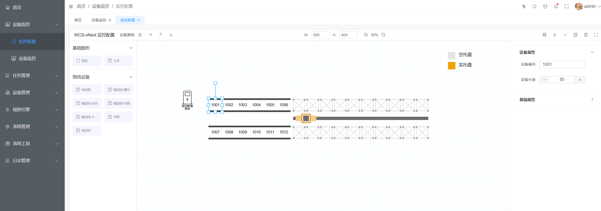
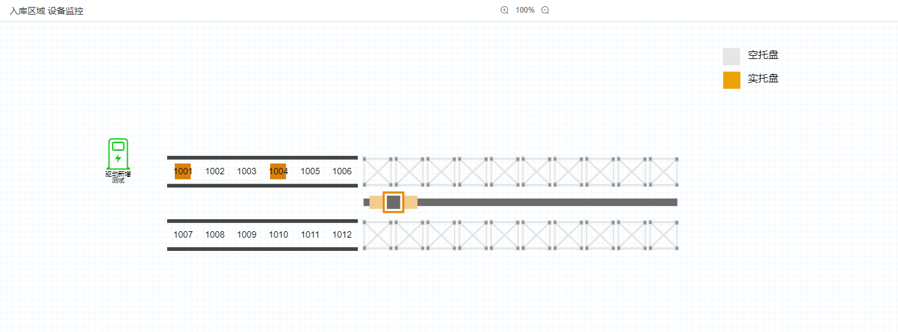
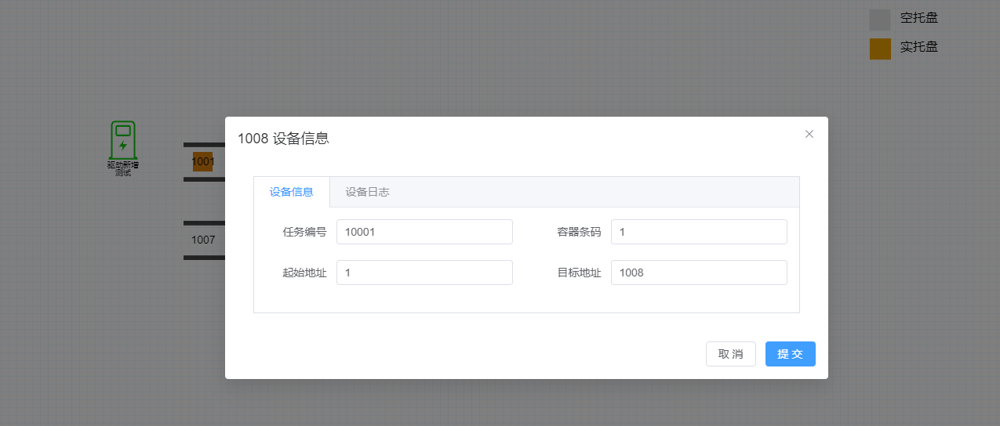
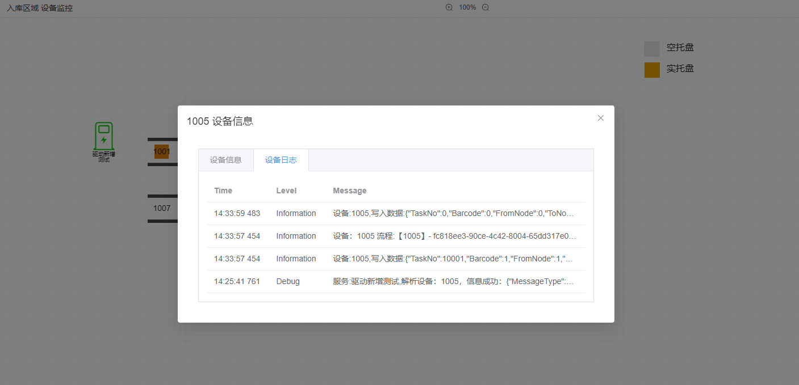
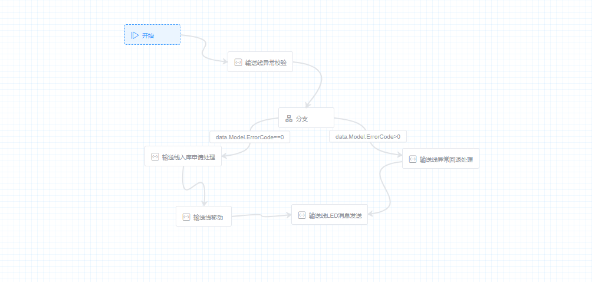
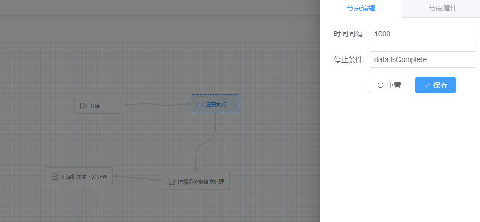

# 什么是wcs-vnext?

wcs-vnext 是一个高效、易用的 WCS 项目搭建和监控平台。

[快速开始](../getting-started/)

## 场景搭建



::: info 拖拉拽完成监控界面配置  
   平台采用直观的拖拉拽界面设计，用户可以组件库中选择所需元素，轻松拖放到工作区内，无需编写代码，快速构建监控界面。  
:::

::: info 支持场景拖拽缩放  
   平台支持对监控场景进行拖拽和缩放操作，用户可以自由调整视图大小，方便查看和管理各个监控点，确保每个细节都清晰可见。
:::

::: info 提供设备复制功能快速搭建场景  
   平台提供设备复制功能，用户可以对重复设备进行四个方向复制，提高效率，保证配置的一致性和准确性。
:::

::: info 场景搭建过程引导通信、业务等配置  
   平台提供完整的引导式配置流程，场景搭建过程中引导用户进行通讯、协议、业务等配置，帮助用户顺利实现系统的全面搭建
:::

## 设备监控

::: info 设备数据变化推送
实时监控设备数据变化，并自动推送更新信息，确保用户第一时间掌握设备状态。
:::



::: info 设备数据查询设备控制
用户可以点击设备图标快速查询设备状态，更改设备状态，下发控制指令。
:::



::: info 设备日志查询
当设备报警时，用户可以点击设备图标快速查询近期日志，帮助快速定位异常原因。对于历史问题的分析，Seq客户端提供了丰富的日志追踪和分析功能，用户可以使用Seq客户端进行深入排查和分析
:::


## 设备通讯

::: info Siemens s7
对Siemens s7通讯二次封装，提供界面配置，数据分组读取，设备协议快速生成，协议自动解析成强类型的协议对象，根据设备读写全部、部分数据等功能。
:::

::: info socket
提供底层数据包拆分组合，业务代码无需考虑数据包粘包断包等问题，支持多种类型数据包，固定长、起始结束标识符、固定包头、自定义包头等，提供设备协议解析功能。
:::

## 规则引擎

::: info 可视化流程设计
 支持业务流程可视化配置功能，提供 重复执行、分支等流程控制功能。
:::

- 分支

- 重复执行


::: info 规则引擎
配置设备状态变化触发业务规则配置 支持 c#语法表达式 `TaskNo>10000&&ToNode!=1004`来配置规则。
:::

## 任务管理

::: info 定时任务
定时任务管理、问题排查、日志查询
:::

::: info WCS 任务
WCS 任务查询及操作更新任务状态
:::

::: info WMS 任务
WMS 任务查询及任务回收等操作
:::

## 系统日志

::: info 业务日志
集成 Seq 结构化应用程序日志和跟踪的实时搜索和分析服务器，可以进行日志快速索引追踪  
Seq客户端输入`WorkflowId = '99b968b7-894c-4c9c-b210-986fa5388028'` 可以查询到流程执行过程中的日志
:::

``` js
14 Oct 2024 14:34:01.518
 - Step ea3f73bd-f5c4-4741-be86-d5d4b607ec9c_输送线移动 completed in 0:00:02.1128639
14 Oct 2024 14:34:01.518
 - Step 048a1020-6252-48c7-b899-91e010620e2e_Saga completed in 0:00:02.114649
14 Oct 2024 14:34:01.518
 Workflow 输送线移动 completed in 0:00:02.1153463
14 Oct 2024 14:34:01.517
 设备:1007,写入数据:{'$type': 'ConveryProtocol', Barcode: 1, FromNode: 1, TaskNo: 10001, ToNode: 1008} 成功.
14 Oct 2024 14:34:01.517
 设备:1006,写入数据:{'$type': 'ConveryProtocol', Barcode: 0, FromNode: 0, TaskNo: 0, ToNode: 0} 成功.
14 Oct 2024 14:33:59.484
 设备：1006 流程:【1006_移动】- 99b968b7-894c-4c9c-b210-986fa5388028,开始执行。
```

::: info 操作日志
审计日志，记录界面操作日志
:::

## OpenApi

::: info swagger
 使用 swagger 接口文档，可以很好进行 api 分类、 测试、在线的接口文档参考、自动生成接口文档等功能。
:::

## 权限控制

::: info 用户
用户创建等
:::

::: info 角色
角色创建授权
:::

::: info 权限
菜单权限、按钮权限
:::

::: info 菜单
动态菜单配置
:::
