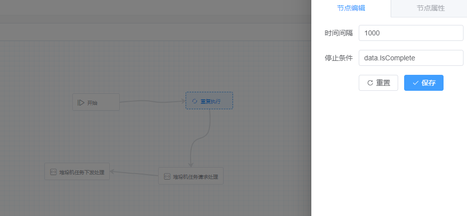
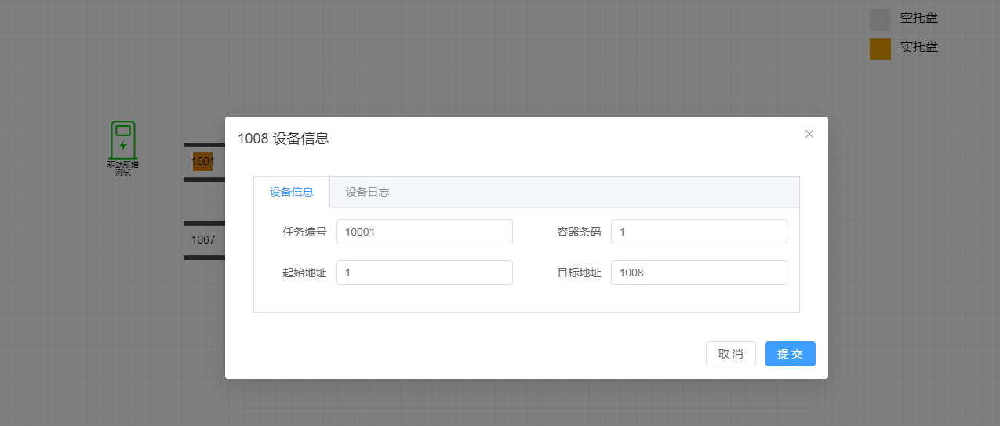

# 快速开始

::: tip
演示wcs项目开发流程：搭建简单场景->配置设备通讯->开发业务->配置业务
:::

## 1、搭建场景

根据实际项目在`设备监控->监控配置`完成搭建场景


### 配置设备协议

在后端项目中协议文件夹中新增输送线任务协议类型，协议类需实现两个标记接口`IDeviceProtocol` 、 设备状态标记接口`IState`

```c#
[Description("输送线任务数据协议")]
public class ConveryProtocol : IDeviceProtocol, IState
{
    [DataMember(Name = "任务号", Order = 1)]
    public int TaskNo { get; set; }

    [DataMember(Name = "条码", Order = 2)]
    public int Barcode { get; set; }

    [DataMember(Name = "起始地址", Order = 3)]
    public int FromNode { get; set; }

    [DataMember(Name = "目标地址", Order = 4)]
    public int ToNode { get; set; }
}
```

::: tip
程序运行时，底层按协议类型字段顺序数据类型将`byte[]`转换成协对象
:::

### 配置通讯连接

在监控配置界面将左边的电控柜拖入画布，侧边设备属性栏新增通信驱动、分组、设备协议

## 2、开发业务

### 创建`Step`

> Step 为流程中的一个步骤，开发完成后可以根据实际场景进行组合成业务流程。  
流程步骤需继承`StepBodyBaseAsync`抽象基类，指定设备模型数据类型`ConveryModelDto`，实现抽象方法`HandleAsync`,方法`HandleAsync`里放置业务代码

```c#
[ProcessAttribute(nameof(ConveryMove), "输送线移动")]
public class ConveryMove(ILoggerFactory loggerFactory, IReadWriteService readWriteService) // 
    : StepBodyBaseAsync<ConveryModelDto>(loggerFactory)
{
    private readonly IReadWriteService _readWriteService = readWriteService;

    // 业务代码
    public async override Task HandleAsync(StepDto<ConveryModelDto> deviceInfo)
    {
       // 设备数据读取
        var (succeeded, errors, cry1002) = await _readWriteService.ReadAsync<ConveryProtocol, ConveryModelDto>("1002");

        // 设备数据写入
        (succeeded, errors) = await _readWriteService.WriteAsync("1002", new ConveryProtocol()
        {
            Barcode = 1001,
            TaskNo = 1002,
            ToNode = 1003
        });

        // 数据部分写入 仅写入任务号和目标地址
        (succeeded, errors) = await _readWriteService.WriteOnlyAsync("1002", new ConveryProtocol()
        {
            Barcode = 1005,
            TaskNo = 1002,
            ToNode = 1004
        }, x => new { x.ToNode, x.TaskNo });

    }
}
```

### 创建后台任务

> 定时任务一般用于`wms任务分解`，`设备状态定时推送`,`led、智能电视等数据定时推送`等需要在程序运行后定时执行的任务。

::: tip
定时任务的实现有多种，`.net`自带的`BackgroundService`,自己实现,abp自身也有 `BackgroundWorker`
项目主要使用Quartz.Net 库。[开源地址](https://github.com/quartznet/quartznet)
:::

```c#
public class WmsTaskDisassembleJob : QuartzBackgroundWorkerBase
{
    private readonly WMSInterfaceService _wmsInterfaceService;

    public WmsTaskDisassembleJob(ISqlSugarRepository<UserEntity> repository, WMSInterfaceService wmsInterfaceService)
    {
        JobDetail = JobBuilder.Create<WmsTaskDisassembleJob>().WithIdentity(nameof(WmsTaskDisassembleJob)).Build();
        Trigger = TriggerBuilder.Create().WithIdentity(nameof(WmsTaskDisassembleJob)).StartNow()
          .WithSimpleSchedule(x => x
              .WithIntervalInSeconds(200) // 间隔时间
              .RepeatForever())
          .Build();

        _wmsInterfaceService = wmsInterfaceService;
    }

    public override async Task Execute(IJobExecutionContext context)
    {
        // 定时任务 逻辑
    }
}
```

## 3、业务配置

流程步骤`Step`开发完成就可以进行`业务流程搭建`、`流程触发规则配置`，完成这两项就可以运行程序进行验证。

### 业务流程搭建

流程搭建

- 开始

每个流程都有且只有一个开始流程，开始流程可以选择流程每个步骤流转`设备模型数据`。

- 业务流程

为后端业务代码继承了`StepBodyBaseAsync` 的业务类型

- 分支

搭建入库申请流程


提供分支控制功能，接入分支节点，可以对分支连出去的线条进行编辑，设置`分支条件`

- 重复执行

可配置`时间间隔`和`结束条件`，接入重复执行节点，该节点后的流程都将根据`时间间隔`重复执行直到满足`结束条件`

搭建堆垛机任务申请流程


### 流程触发规则配置

配置流程触发规则,如输送线货物到位触发`输送线_任务完成业务`， 输送线`目标地址`等于输送线的`设备编号`时表示设备到位，我们可以配置规则表达式为`ToNode=='设备编号'`,满足条件后触发的业务为`输送线_任务完成业务`。

## 4、运行效果

- 设备监控

- 设备信息

- 设备运行日志

